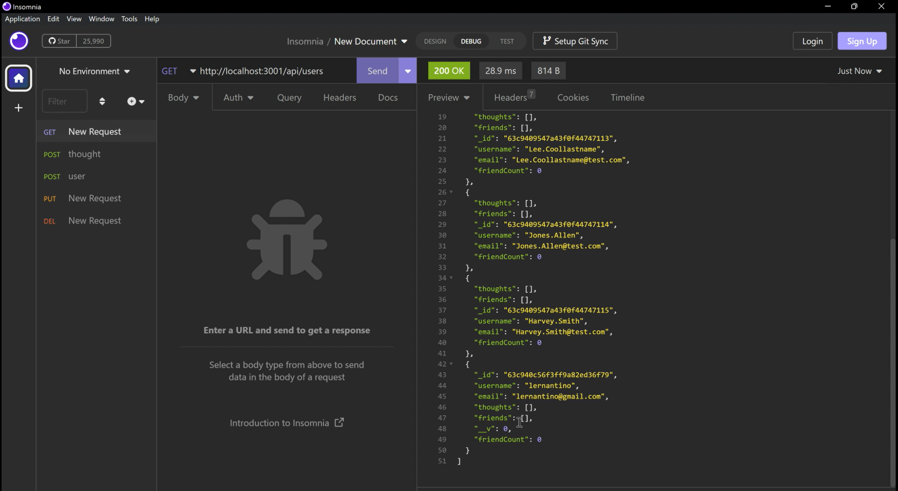

# social-network-api

## Description

MongoDB is a popular choice for many social networks due to its speed with large amounts of data and flexibility with unstructured data. This application will build an API for a social network web application where users can share their thoughts, react to friends’ thoughts, and create a friend list.

<br><br>

<br><br>
Click [HERE](https://drive.google.com/file/d/1defoxPiyOZAgM3VugRPqkJu-hIMPrhHS/view) to view a full video demonstrating a walkthrough of how to run the application.

    
## Table of Contents
    
- [Description](#description)
- [Installation](#installation)
- [User Story](#usage)
- [Acceptance Criteria](#acceptance-criteria)
- [License](#license)
- [Contribution](#contribution)
- [Tests](#tests)
- [Questions](#questions)
    
## Installation
    
```
npm install

npm run seed

npm start

```


## User Story
    
```
AS A social media startup
I WANT an API for my social network that uses a NoSQL database
SO THAT my website can handle large amounts of unstructured data

```
## Acceptance Criteria
```
GIVEN a social network API
WHEN I enter the command to invoke the application
THEN my server is started and the Mongoose models are synced to the MongoDB database
WHEN I open API GET routes in Insomnia for users and thoughts
THEN the data for each of these routes is displayed in a formatted JSON
WHEN I test API POST, PUT, and DELETE routes in Insomnia
THEN I am able to successfully create, update, and delete users and thoughts in my database
WHEN I test API POST and DELETE routes in Insomnia
THEN I am able to successfully create and delete reactions to thoughts and add and remove friends to a user’s friend list


```
    
## License
    

    
## Contribution
    
N/A
    
## Tests
    
N/A
    
## Questions
    
If there are any questions or concerns, please contact me at:<br>
[GitHub](https://github.com/khanhpbui)<br>
[Email](mailto:pkkhanhbui@gmail.com)